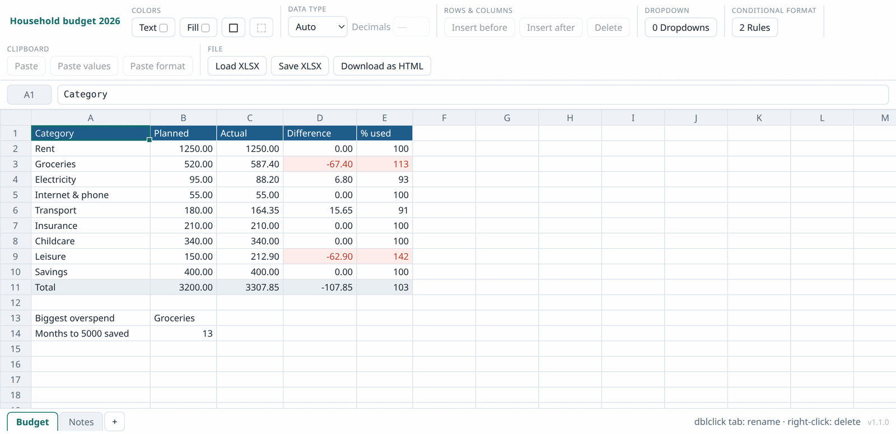

# Simple xlsx

A spreadsheet that is one HTML file.

Open `gridfile.html` in a browser and you have a working sheet: type numbers, write
formulas, format cells, open an `.xlsx`, save an `.xlsx`. There is no installer, no
account, no server, and nothing to keep running. Copy the file onto a USB stick and
it works on the next machine.

*A household budget: totals by `SUM`, the worst line found with `INDEX`/`MATCH`, and
a conditional-format rule colouring anything over plan. One file, no install.*

## Why

Two ordinary problems:

- **You need to open or fix a spreadsheet on a machine with no office software.**
  A borrowed laptop, a fresh install, a locked-down work computer. Every machine has
  a browser.
- **You do not want the file leaving your computer.** Salary figures, invoices, a
  medical log, anything you would rather not upload to a cloud service just to add a
  column.

This page makes no network requests of any kind. Your data goes from the file, to
the browser, and back to your disk. You can verify that yourself — it is one file,
and you can read it.

## What it is not

A hobby-level project, and deliberately not a replacement for Excel or LibreOffice.
The aim is to cover about 95% of what a person actually does with a spreadsheet at
home, and to be honest about the rest. Not supported, and not planned:

- charts and diagrams
- pivot tables, macros, VBA
- serious statistics
- large data — this is for hundreds of rows, not hundreds of thousands
- collaborative editing

If you need any of those, use a real spreadsheet program. That is what it is for.

## What it does

- **Sheets** — several per workbook, renamed by double-clicking a tab.
- **Formulas** — about 100 functions with Excel syntax and Excel's `#DIV/0!`,
  `#N/A`, `#VALUE!` error values: arithmetic and rounding, `AVERAGE`/`MEDIAN`/
  `COUNT*`, `IF`/`IFS`/`IFERROR`, `SUMIF(S)` and `COUNTIF(S)`, `VLOOKUP`/`INDEX`/
  `MATCH`/`XLOOKUP`, the usual text functions, dates, and `PMT`/`FV`/`PV`/`NPV`.
  The `&`, `^` and `%` operators work, references may cross sheets, and dragging the
  fill handle shifts references the way you expect (`$A$1` stays put).
- **Formula help** — start typing a function name and a list of matches appears with
  its arguments and a one-line description; arrow keys and Tab or Enter pick one.
  Once you are inside the brackets the popup shows the signature with the argument
  you are currently on highlighted, so you can see how many arguments are left and
  which are optional. Arguments may be separated with either `,` or `;`.
- **Formatting** — text and fill colours, borders, number/text/date cell types,
  decimal places.
- **Dropdowns** — a cell can be restricted to a list of values.
- **Conditional formatting** — rules that colour a cell by its value.
- **Editing** — insert and delete rows and columns, resize them by dragging, undo
  and redo, copy/cut/paste including paste-values-only and paste-format-only.
- **Files** — load and save `.xlsx` (readable by Excel, LibreOffice and Google
  Sheets), or save the page itself with the data baked in.

The layout follows the width of the window, not the kind of machine, so a desktop
browser dragged narrow gets the same treatment as a phone. Above 1100px nothing
changes. Below it the group captions go and the buttons wrap. Below 700px the grid
takes over: the toolbar shrinks to a 44px bar holding the document name, a **☰**
button for the sheet list and a **⋯** menu for loading and saving files, and the
groups move to an icon strip directly beneath it, where each icon opens a panel with
that group in it. The strip sits above the formula bar and never moves, so the
actions are always in the same place. The formula bar never collapses.

Two things are quicker by touch than by icon: long-press a row number or column
letter for insert and delete, and long-press the selection for the paste options.
Tap a cell to select it, double-tap to edit.

Work is kept in the browser's local storage as you go, so closing the tab by
accident does not lose it. That storage is per browser and per machine, though — the
`.xlsx` or the downloaded HTML is the thing you actually keep and back up.

**Download as HTML** writes out a copy of this same page with your data inside it.
That copy is a document and an application at once: mail it to someone and they can
open and edit it with no software at all.

## Getting started

Open the file. That is the whole procedure.

To put it on a web server so others can download their own copy, serve
`gridfile.html` as a static file; it needs nothing else. Enable gzip if you can —
the page compresses from about 120 kB to under 40 kB.

Every copy shows its version number next to the sheet tabs — bottom right on a wide
screen, inside the **☰** sheet list on a phone — so you can always tell which build
someone is running.

## Limits

- 26 columns and 100 rows to start with; +100 rows under the grid and +10 columns
  past the last column header add more, up to 200 columns and 5000 rows.
- Importing an `.xlsx` keeps values, formulas we implement, colours, borders, number
  formats, column widths and row heights. Anything else — charts, images, pivot
  tables, macros — is dropped, and a formula using a function we do not have keeps
  the value Excel last calculated for it, but stops being live.
- Dates are stored as text in ISO form (`2024-03-05`); `5.3.2024` and `3/5/2024` are
  accepted when you type them.
- `VLOOKUP` defaults to an *exact* match, where Excel defaults to an approximate
  one. Pass `TRUE` as the fourth argument for the approximate behaviour. Exports
  spell this out, so a file opened in Excel gives the same answers.

## Development

The program is one HTML file with no dependencies. It comes in two copies:
`gridfile.html`, the readable source you edit and can open in a browser as-is, and
`dist/gridfile.html`, the release people download — the same program with the
comments and indentation stripped out, and nothing else changed.

    npm test        # runs the tests and rebuilds the release
    npm run build   # just rebuild dist/gridfile.html

Edit `gridfile.html` and reload the browser; never edit `dist/`, as the next build
overwrites it. `docs/architecture.md` explains the internals; `AGENTS.md` is the
entry point if you are pointing an AI coding agent at the repository. The tests run headlessly in Node with no dependencies: they slice the
formula engine straight out of the HTML rather than keeping a copy, and run it twice
— once against the source and once against the built release. See `test/README.md`.

Keeping the page small is a design constraint, not an accident: the test suite fails
if the file grows past 125 kB, and warns above the 120 kB goal. When adding a
feature costs more bytes than it is worth to a person keeping a household budget, it
does not go in.

When releasing, bump `<meta name="app-version">` in the `<head>` and move the
`Unreleased` section of [CHANGELOG.md](CHANGELOG.md) under the new number.

## License

MIT — see [LICENSE](LICENSE). Do what you like with it; no warranty.
